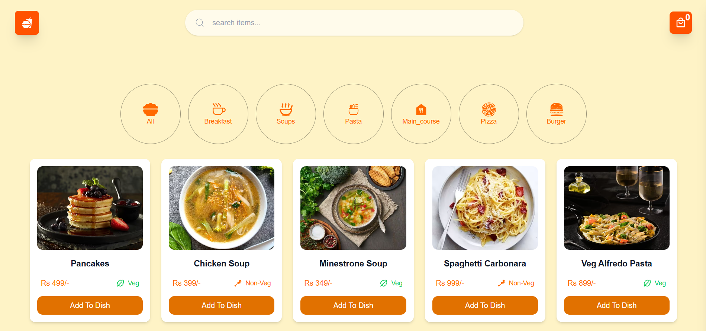

# 🍔 Food Ordering App
A modern and responsive Food Ordering Application built with React. Users can browse food items, search for dishes, filter by categories, add items to cart, and manage their orders easily.

## 🚀 Tech Stack

- React.js
- JavaScript (ES6+)
- Redux Toolkit
- Context API
- React Icons
- react-toastify
- Tailwind CSS

## ✨ Features

- 🍕 Browse food items
- 🔍 Search food by name
- 📂 Filter food items by category
- ➕ Add food items to cart
- ❌ Remove food items from cart
- 🛒 Real-time cart management
- 📱 Fully responsive design
- ⚡ Fast state management using Redux Toolkit and Context API

## 🧠 State Management

### Context API
Used for managing global UI-related states and sharing data across components without prop drilling.

### Redux Toolkit
Used for cart management, including:
- Add items to cart
- Remove items from cart
- Update item quantity
- Calculate total price

## 📸 Screenshots

### Home Page

